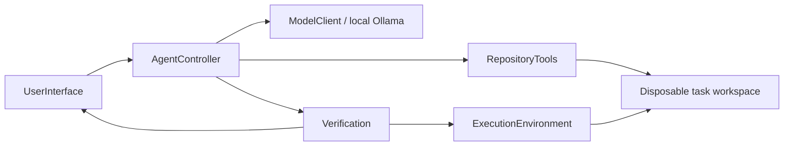

# Coding Harness

A small Python CLI that uses a local Ollama model to inspect and edit a disposable copy of a configured repository. Every task has a new workspace and model context. The model can use only the contained `list`, `read`, `search`, and `edit` repository tools; it cannot run arbitrary commands. After the model finishes, the harness runs the configured repository checks in the OS-enforced sandbox and shows the changed files, bounded diff, check output, and exit codes. A model's final response never overrides failed or unavailable checks.

## Run

Use Python 3 and start from the project root:

```bash
python3 src/main.py
```

The default target is `./target-repository`. Select another local checkout with `--repository /path/to/repository` or set `CODING_HARNESS_REPOSITORY`. Ollama must already be running locally and the chosen model must be available; configure it with:

```bash
export CODING_HARNESS_OLLAMA_ENDPOINT=http://localhost:11434
export CODING_HARNESS_OLLAMA_MODEL=qwen2.5-coder:7b
python3 src/main.py --repository ./target-repository
```

No harness package installation is needed. The default configured check is `python3 tests/test_core.py`, run only inside the macOS `sandbox-exec` sandbox. On a platform without the supported sandbox, or if its boundary probe fails, verification is reported unavailable and repository code is not run.

At the `Task>` prompt, enter a task, `/help`, or `/quit`. Multiple tasks can be submitted in one process; each task receives a fresh file copy and an empty model conversation. Review the printed diff and check results. Each task also creates a separate root-level `coding-harness-task-<unique-id>.log`, reports its path when it starts, and appends timestamped progress, model steps, tool actions/results, verification output, counters, and failures as they happen. The log remains available after the task and is ignored by Git. Logs can contain task text, model/tool output, repository snippets, and check output; keep them private and remove them when no longer needed. Task workspaces are retained at the shown path for inspection; this delivery does not apply changes to the configured repository and has no approval/apply workflow.

## Collaborators and flow



For each task, the controller sends the request, a filtered file listing, and instructions to inspect existing tests and add or update relevant regression tests whenever the requested behavior is testable. Documentation-only work and other non-testable tasks need not edit a test file; the model should explain when testing is not applicable. The controller validates each exact JSON response, dispatches only permitted repository tools, and returns tool results to the model. A final response invokes `Verification`; only actual configured check results determine whether verification passed.

## Safety and limits

- The configured repository is copied for a task and is never a tool or check working directory. The harness does not write back to it.
- File tools resolve paths under the task workspace, reject escapes (including outside symlinks), limit file reads, omit secret-like/generated/binary files, and restrict edits to text files.
- Model output must be exactly one JSON object with either a tool request or final response. Extra fields, duplicate keys, prose, malformed JSON, unknown tools, and invalid arguments are denied without executing a tool.
- Repository checks come from the harness configuration; model-provided commands are never accepted. Repository commands run with the ticket 01 macOS sandbox, no network, a 60-second command timeout, and at most 64 KiB from each output stream.
- The controller allows at most 30 successful tool actions, 3 invalid-action retries, 40 model responses, 64 KiB per model response, and 64 KiB per returned tool result. The CLI displays action, denied-action, retry, and response counters.
- Verification reports unavailable checks as failures to verify, preserves nonzero exit codes and output, and limits the displayed diff to 64 KiB.
- The sandbox is an OS boundary, not a guarantee against every possible vulnerability in the host runtime. Do not treat the harness as a production multi-user security boundary.

The configured OpenStock core test requires the local, git-ignored `target-repository/data/openstock.db`; it is not included in the source checkout. If unavailable, the harness retains and reports its nonzero check result instead of claiming success. The legacy Windows-only `import_access.py` importer is not run automatically.
