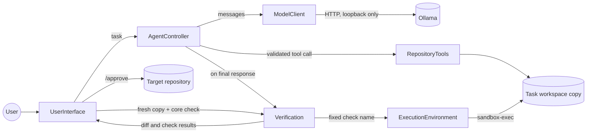
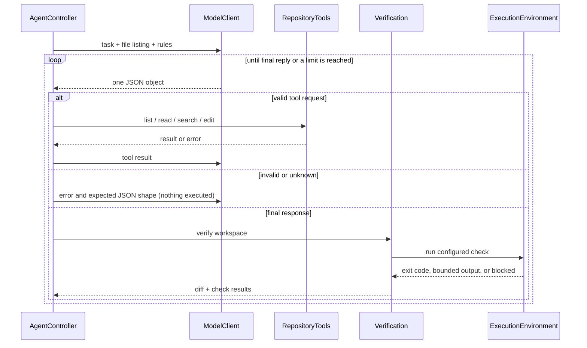
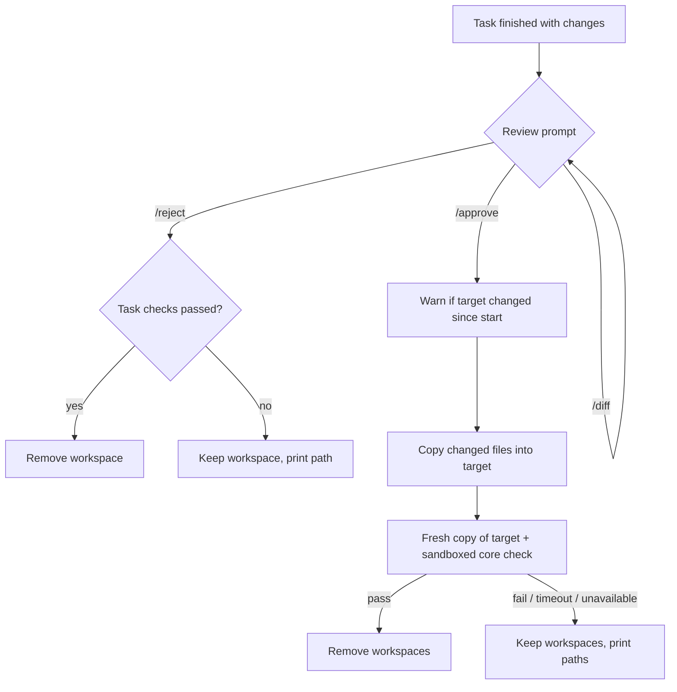

# Coding Harness

A small Python CLI that uses a **local Ollama model** to inspect and edit a **disposable copy** of a configured repository. You chat with it task by task; after each task you review the diff and either `/approve` it (apply to the repository) or `/reject` it.

The model can only use four bounded tools (`list`, `read`, `search`, `edit`). `read` returns at most 200 lines per call (use `start`/`end` for a line range; the result reports the total line count), and `edit` has five modes: write a whole file (`content`), replace one exact snippet (`old`/`new`; a unique match may ignore leading indentation), insert lines after a line number (`after_line`/`text`), replace an inclusive line range (`start_line`/`end_line`/`text`), or replace one Python function (`function`/`function_content`) while preserving its decorators and surrounding code. A final reply before any tool action is denied once. It cannot run commands. After it finishes, the harness itself runs the repository's configured check inside an OS-enforced sandbox. The model's claim of success never overrides a failed or unavailable check.

## Prerequisites

| Need | Details |
|---|---|
| Python | 3.10 or newer (tested with 3.14). Standard library only; nothing to install. |
| Sandbox | macOS with `/usr/bin/sandbox-exec`. On any other platform repository checks are reported **unavailable** and no repository code runs. |
| Model | [Ollama](https://ollama.com) running locally with a pulled model, e.g. `ollama pull qwen2.5-coder:7b`. Only loopback endpoints are accepted. |
| Target | A local repository. The default is `./target-repository` (OpenStock). Its core check needs the git-ignored `target-repository/data/openstock.db`; the harness does not create it (the legacy `import_access.py` importer is Windows-only). |

## Configuration (no secrets needed)

All settings are optional. Example (copy into your shell; there are no keys or tokens):

```bash
export CODING_HARNESS_OLLAMA_ENDPOINT=http://localhost:11434
export CODING_HARNESS_OLLAMA_MODEL=qwen2.5-coder:7b
export CODING_HARNESS_REPOSITORY=./target-repository
export CODING_HARNESS_OLLAMA_TIMEOUT=300   # seconds per model request (slow local models need minutes)
```

## Run

From the project root:

```bash
python3 src/main.py
python3 src/main.py --repository /path/to/other/repository   # override the target
python3 src/main.py --help
```

Run the harness tests (no Ollama needed; they use scripted models):

```bash
python3 -m unittest discover -s tests -v
```

## Using it

At the `Task>` prompt:

| Input | Effect |
|---|---|
| any text | Starts a new task: fresh workspace copy and fresh model conversation (nothing carries over from earlier tasks). One task runs at a time. |
| `/help` | Shows the controls. |
| `/quit` | Exits. |

While a task runs you see `[progress]` lines for each model request and tool action. Each task also writes `coding-harness-task-<id>.log` in the project root (git-ignored): timestamped steps, tool results, rejected raw model replies, check output, counters and, at the end, the final diff. Logs can contain task text, repository snippets and check output; keep them private.

When the model finishes you see the final response, counters, changed files, a bounded diff and the check results (exit code, output, `PASS`/`FAIL`/`TIMED OUT`/`UNAVAILABLE`).

If files changed, a `Review>` prompt follows:

| Input | Effect |
|---|---|
| `/diff` | Shows the diff and check results again. Nothing is applied yet. |
| `/reject` | Target unchanged. The workspace is removed if its checks passed, otherwise kept and its path printed. |
| `/approve` | Copies every changed file into the target (see below). |

`/approve` details:
1. If the target changed since the task started, a `WARNING` lists the differing files. Approval still **force-applies** the task's files over them.
2. The core check then runs in the sandbox on a **fresh copy of the updated target** (repository code is never run directly in the target). Output and exit code are printed.
3. On success both workspaces are removed. On a failed, timed-out or unavailable check they are kept and their paths printed.

Ctrl-D during review applies nothing and keeps the workspace. The process exits non-zero if any task or post-apply check did not pass. The harness has no delete tool, so approved changes are creations and edits.

## Components

| Component | File | Responsibility |
|---|---|---|
| `UserInterface` | `src/coding_harness/cli.py` | Prompts, progress, result display, review (`/approve`, `/reject`, `/diff`). |
| `AgentController` | `agent.py` | Runs the model-tool loop, validates every reply, enforces limits, writes the task log. |
| `ModelClient` | `model.py` | Non-streaming Ollama chat call; constrains replies to the action JSON schema. |
| `RepositoryTools` | `repository.py` | `list`/`read`/`search`/`edit`, confined to the task workspace. |
| `ExecutionEnvironment` | `execution.py` | Runs fixed checks in the macOS sandbox with timeout and bounded output; fails closed. |
| `Verification` | `verification.py` | Captures the starting state, builds the diff, runs configured checks. |

Small helpers, kept outside the six collaborators because they have no state or policy of their own: `workspace.py` (copy the repository for a task) and `review.py` (detect target changes and copy approved files). `main.py` is only the entry point.



Model-tool loop for one task:



Review and apply:



## Real-model demo

`python3 demo/run_demo.py` runs the quote-quantity demo against a fresh copy of `target-repository`. To run the multi-module quote-deletion demo, use `python3 demo/run_demo.py delete-quote`. It checks the public `quotes.delete_quote()` behavior and the DELETE `/api/quote/<no>` endpoint through Flask's test client, including preserving successful deletion. Because the 7B model may stop after a single-file change, this demo splits the work into two small tasks: enter and approve each displayed task in order, then enter `/quit`. The runner first proves the selected external acceptance check fails on the untouched copy and afterwards re-runs the acceptance and configured `core` checks in the sandbox, writing `demo-record-*.md` (git-ignored) with the verdict. For the quote-quantity demo, suggested task wording: `In quotes.py, in create_quote, directly after the line price = float(e.get("price") or 0) add a new check: if qty <= 0 then raise ValueError("Quote line quantity must be positive."). Do not change anything else.` The 7B model is not deterministic; a failing run is reported honestly (reject it and try again).

## Safety and limits

**The disposable copy is not the sandbox.** It only keeps edits away from the target until you approve. Isolation of repository code comes from the OS sandbox:

- Containment boundary (macOS `sandbox-exec`, default deny): repository code may write only inside its task workspace, read only the workspace and the Python runtime, and has no network. Child processes cannot leave the process group, which is killed on timeout and on completion.
- **Fail closed:** before each check a probe verifies workspace writes work and host writes/reads and network are blocked. If the sandbox is missing, unsupported or the probe fails, the result is `UNAVAILABLE` and no repository code runs. There is no plain-subprocess fallback.
- Limits: 30 tool actions, 3 invalid-reply retries, 40 model responses, 64 KiB per model reply and per tool result, 256 KiB per file read/edit, 60 s per check, 64 KiB per check output stream, 64 KiB displayed diff. Reaching a limit stops the task and the counters are shown.
- Model replies must be exactly one JSON object (a single markdown fence is tolerated). Extra fields, duplicate keys, prose, unknown tools and bad arguments are denied without executing anything.
- File tools reject paths outside the workspace (including symlinks), omit secret-like, generated and binary files, and only edit text files.
- Disabled: arbitrary shell commands, model-chosen commands, network access, Git mutation, package installation, push, merge and deployment. Only the fixed configured check can execute.
- The sandbox is an OS boundary, not a guarantee against every host-runtime vulnerability; this is not a production multi-user security boundary.

## Verification

- **Configured repository check** (`python3 tests/test_core.py`): the repository's own regression tests. Passing means existing behavior still works. It does not prove the requested task was done correctly.
- **Task-specific acceptance evidence** is separate: a check for the requested behavior that lives outside the task workspace and is run against the result. The harness does not run one automatically; the model may add tests to the workspace, but those are only evidence if you review them.
- Failures are never hidden: a nonzero exit shows `FAIL (exit code N)` with its output, a timeout shows `TIMED OUT`, and a missing or failed sandbox shows `UNAVAILABLE: <reason>`. The model's final message is printed but labelled non-authoritative when verification did not pass.
- Small local models may claim an edit they did not make. The harness shows the real result (`Changed files: (none)`).
